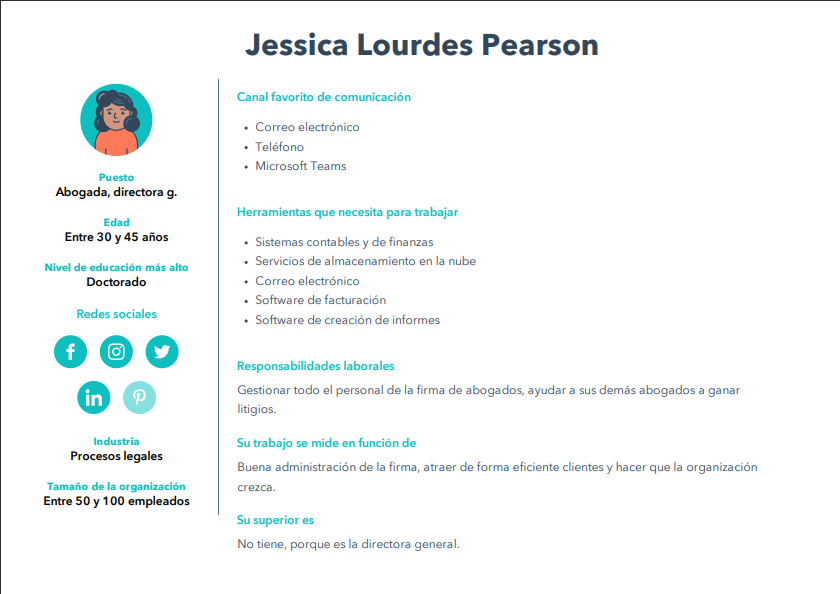

# Abogabot.

## 1. Toma de requerimientos.
### ***Usuario Solicitante***

- El usuario debe poder hacer lo siguiente:

Crear una cuenta para así luego llenar un formulario con la demanda que quiere enviar. Luego de esto, ir a la página de pago y mostrar distintos métodos de pago. Con esto ya hecho, en su cuenta debe verse las demandas que hay, puede hacerle seguimiento y ver los comentarios del abogado. Además, que le llegue por correo electrónico cuando se actualice algo en su demanda. El usuario también pidió que los colores fueran azul marino y blanco pero que acepta sugerencias. Por último, que la página debe ser responsive, es decir, que se pueda ver bien tanto en PC como en móvil. 

- El administrador debe poder hacer lo siguiente:

Recibir una notificación de cada demanda y al llegar se debe crear automáticamente un documento de Word para comenzar el proceso. Debe ser capaz de ver los pagos, actualizar el estado de la demanda y agregar comentarios en cada parte del proceso. Por último, debe ser capaz de ver la cantidad de ingresos recibidos en un dashboard. 

### ***Lider funcional***

- Se entiende claramente que el usuario debe poder ser capaz de crear una cuenta, llenar un formulario para la demanda, pagar con diferentes métodos de pago y luego poder hacerle seguimiento desde su cuenta y por notificaciones de correo a la demanda ya creada, además de ver los comentarios del abogado.  La página debe ser de azul marino y blanco, pero se aceptan sugerencias. 
- Con respecto al administrador, se entiende que debe poder recibir una notificación cuando una nueva demanda llegue, y debe crearse un documento de Word de forma automática para continuar con el proceso. Debe poder ver el pago de las demandas y la cantidad de ingresos en un dashboard, actualizar el estado de la demanda y agregar comentarios.

### ***Modelo de negocio***

Diagrama en PDF ---> [Diagrama Abogabot](./Diagrama%20de%20Abogabot.pdf)

## 2. Buyer persona.

## 3. Público objetivo.

## 4. UX/UI.
