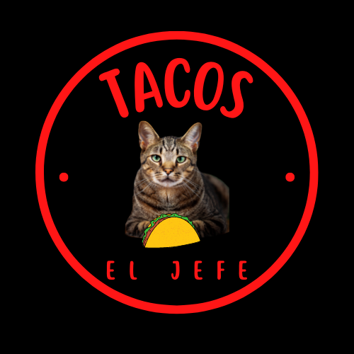

# Prácticas de HTML.

## 1. Tacos "El Jefe"

Esta práctica se hizo en clase con ayuda del Mission Comander y le hice algunas modificaciones. Además, tiene un logo diferente.

El logo siguiente también está en la carpeta de este módulo.

 
#### Código de la práctica: [Tacos El Jefe](./TacosElJefe.html)

## 2. Mishi Pastelería
