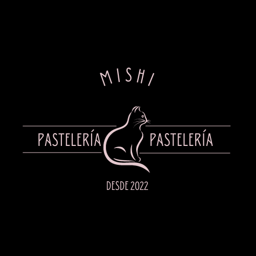

# Prácticas de HTML.

No tienen CSS porque es una práctica de solo HTML pero en un futuro planeo implementarlo.

## 1. Tacos "El Jefe"

Esta práctica se hizo en clase con ayuda del Mission Comander y le hice algunas modificaciones. Además, tiene un logo diferente.

El logo siguiente también está en la carpeta de este módulo.

 
#### Código de la práctica: [Tacos El Jefe](./TacosElJefe.html)
#### Visualización de la página: [Tacos El Jefe](https://brayandoria98.github.io/PastelereriaYTacosElJefe/TacosElJefe.html)

## 2. Mishi Pastelería

Aquí se encuentra el código de la página de la pastelería, tanto para el cliente como para el pastelero.

#### Código de la pastelería cliente: [Mishi Pasteleria Cliente](./MishiPasteleriaCliente.html)
#### Código de la pastelería pastelero: [Mishi Pasteleria Pastelero](./MishiPasteleriaPastelero.html)

#### Visualización de la página: [Cliente](https://brayandoria98.github.io/PastelereriaYTacosElJefe/MishiPasteleriaCliente.html)
#### Visualización de la página: [Pastelero](https://brayandoria98.github.io/PastelereriaYTacosElJefe/MishiPasteleriaPastelero.html)

